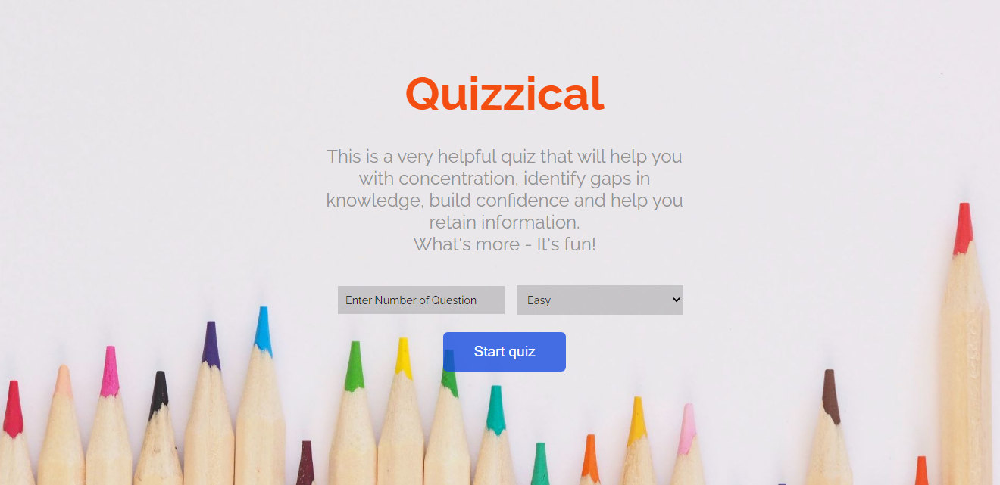
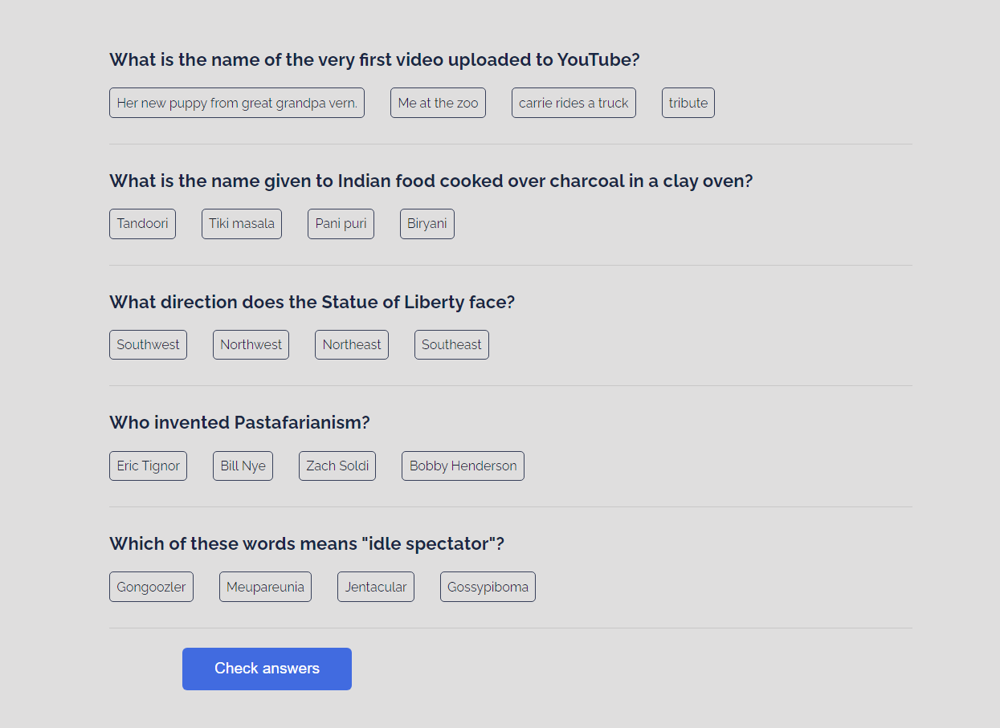
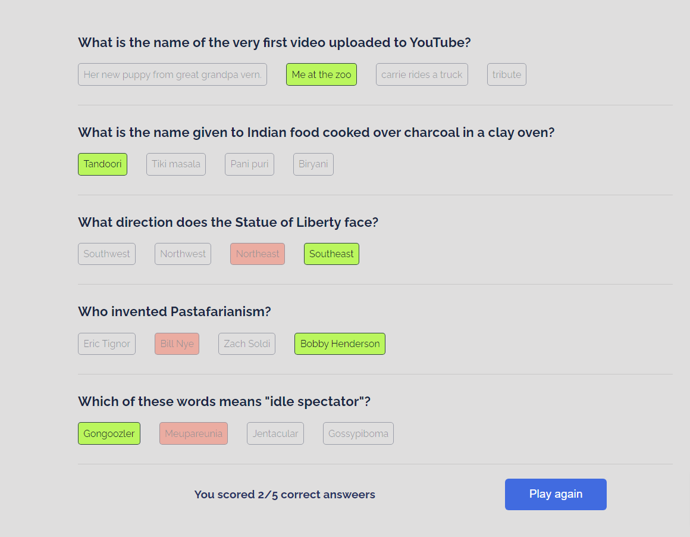

# Quiz App

## Overview
 Quiz App is a app that helps you learn. Basically, It provides multiple choice questions
 based upon your preferences. After the submission of answers, it also show the correct
 answer and your total score in a good manner.

### Screenshots

   

   

   

### Links

- Live Site URL: [Quiz App](https://react-quiz-io.netlify.app/)

## My process

### Built with

- Semantic HTML5 markup
- CSS custom properties
- Flexbox
- CSS Grid
- Desktop first workflow
- @media queries
- API
- [React](https://reactjs.org/) - JS library

### What I learned
- How to handle and customize API based upon user activity
- How to make working loader
- How to determine user score and highlight the right anwser.

## Contribute
Open to Contributions.

## Author

- Website - [Sagar Sharma](https://sagar-io.github.io/)
